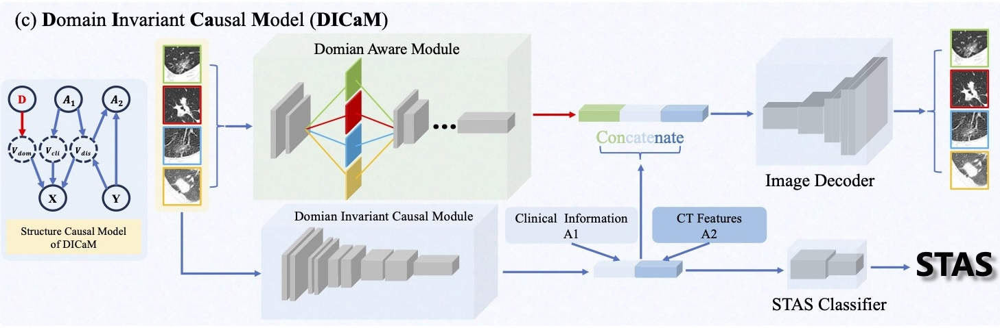

# DICaM: Domain Invariant Causal Model for STAS Prediction

Official implementation of **DICaM** (Domain Invariant Causal Model) for predicting Spread Through Air Spaces (STAS) in lung adenocarcinoma histopathology images.

<p align="center">
  
</p>

## Method Overview

STAS prediction from histopathology images faces two key challenges: (1) **domain shift** across different scanning devices and hospitals, and (2) **limited training data**. DICaM addresses both via causal disentanglement and synthetic data augmentation.

### Structural Causal Model

DICaM is built upon a structural causal model (SCM) that decomposes the latent representation of a histopathology image into three disentangled factors:

- **V_dom** (domain factor): captures scanner- and site-specific visual variations (e.g., staining intensity, resolution artifacts). Modeled with a domain-conditional prior p(V_dom | D), where D is the device/hospital indicator.
- **V_cli** (clinical factor): encodes clinically relevant attributes (e.g., tumor subtype, differentiation grade). Supervised by clinical metadata A1 via a GCN-based relational module.
- **V_dis** (disease factor): represents STAS-related morphological patterns (e.g., micropapillary clusters, tumor cell detachment). This is the causal factor for disease prediction Y, also linked to CT imaging features A2.

The key insight is that **only V_dis causally determines the STAS label Y**, while V_dom is a confounder that should be marginalized out during inference. This separation ensures domain-invariant prediction.

### Training Objective

DICaM is trained as a causal variational autoencoder (CVAE). The per-sample ELBO objective decomposes as:

- **Reconstruction**: log p(X | V_dom, V_cli, V_dis) — the image decoder reconstructs X from all three factors.
- **Disease prediction**: log p(Y | V_dis) — STAS classification uses only the disease factor.
- **Clinical attributes**: log p(A1 | V_cli, V_dis) + log p(A2 | V_dis, Y) — auxiliary supervision from clinical metadata.
- **KL regularization**: the variational posterior is factorized into a domain-invariant part q(V_cli, V_dis | X) (shared across all domains) and a domain-specific part q(V_dom | X, D) (with domain-specific batch normalization), each regularized toward its respective prior.

### Inference with Latent Optimization

At test time, DICaM refines the domain-invariant latent variables (V_cli, V_dis) via gradient-based optimization, maximizing the posterior given the observed image and available clinical attributes. The final STAS prediction is: Y* = argmax_y p(Y | V_dis*).

### Data Augmentation

To address data scarcity, DICaM supports mixing synthetic histopathology images into the training set. The mixing ratio (e.g., 3x = 300% additional generated data) is controlled via `--gen_data_ratio`.

## Project Structure

```
DarMo_stas_ready/
├── run.py                  # Training entry point
├── run_eval.py             # Evaluation entry point (metrics only)
├── train.sh                # Training launcher (0x and 3x experiments)
├── test.sh                 # Evaluation launcher
├── requirements.txt        # Python dependencies
├── models/
│   ├── Maintrainer_stas.py # DICaM model (CVAE + GCN + classifiers)
│   ├── backbone_factory.py # Backbone builder (ResNet-18, etc.)
│   ├── feature_learning.py # Feature extraction blocks
│   ├── hiarachical_layers.py # Hierarchical feature modules
│   ├── ma_learning.py      # GCN for clinical attribute graph
│   ├── Basenet.py          # Base network utilities
│   └── adjacency_matrix.pkl # Pre-computed adjacency matrix for GCN
├── data/
│   ├── STAS_dataloader.py  # Dataset loader
│   ├── batchsampler.py     # Class-balanced batch sampler
│   ├── gen_mix.py          # Generated data mixing utilities
│   └── transforms.py       # Data transforms
├── utils/
│   ├── baseTrainer.py      # Training loop orchestrator
│   ├── train.py            # Single-epoch training logic
│   ├── valid.py            # Validation logic
│   ├── eval_interventions.py # Causal intervention evaluation
│   ├── losses.py           # Loss functions (reconstruction, SSIM, etc.)
│   ├── opts.py             # Command-line argument parser
│   ├── save_checkpoint.py  # Checkpoint saving utilities
│   └── utils.py            # General utilities (AverageMeter, samplers, etc.)
└── metrics/
    ├── accuracy.py         # Accuracy meter
    ├── confu_metrics.py    # Confusion matrix metrics
    └── myAUC.py            # AUC meter
```

## Requirements

- Python >= 3.8
- PyTorch >= 1.12.0
- CUDA-compatible GPU (recommended)

Install dependencies:

```bash
pip install -r requirements.txt
```

## Data Preparation

**Note: We do not release the dataset in this repository.** You need to prepare your own data and configure the paths accordingly.

### Expected Data Format

1. **Dataset Excel file** (`--dataset_excel`): An `.xlsx` or `.xls` file containing columns for image paths, labels, fold assignments (train / test_inter / test_exter / test_exter2), machine IDs, hospital IDs, and clinical attributes. The file should have the following sheets/columns structure:
   - Image relative path (relative to `--data_root`)
   - Binary label (0: STAS-negative, 1: STAS-positive)
   - Fold indicator: `train`, `test_inter` (internal test), `test_exter` (external test 1), `test_exter2` (external test 2)
   - Machine ID (integer, for domain conditioning)
   - Hospital ID (integer)
   - Clinical attributes (14 binary attributes for the GCN module)

2. **Image directory** (`--data_root`): Root directory containing all histopathology patch images (128x128 grayscale or resizable).

3. **Generated data Excel** (`--gen_data_xls`, optional): For data augmentation experiments, an `.xls` file listing generated image paths and metadata (sheets: `batch_0` ... `batch_9`).

### Configuring Paths

Edit the path variables in `train.sh` and `test.sh`:

```bash
# In train.sh and test.sh, replace these placeholders:
DATASET_EXCEL="<YOUR_DATASET_EXCEL_PATH>"
DATA_ROOT="<YOUR_DATA_ROOT>"
GEN_XLS="<YOUR_GEN_DATA_EXCEL_PATH>"  # only needed for train.sh with 3x
```

## Training

```bash
chmod +x train.sh
./train.sh
```

This launches two experiments in parallel:
- **0x** (GPU 0): training without generated data mixing
- **3x** (GPU 1): training with 300% generated data augmentation

Training logs are saved to `logs/`. Checkpoints are saved to `exp_0x_res/checkpoints/` and `exp_3x_res/checkpoints/`:
- `best_inter_auc.pth.tar` — best internal test AUC (model selection criterion)

### Key Hyperparameters

| Parameter | Default | Description |
|-----------|---------|-------------|
| `--lr` | 0.0001 | Learning rate |
| `--lr_schedule` | cosine | LR schedule (cosine / decay) |
| `--epochs` | 100 | Training epochs |
| `--batch-size` | 32 | Batch size |
| `--backbone` | resnet18 | Backbone architecture |
| `--pretrained` | flag | Use ImageNet pre-trained weights |
| `--para_cls` | 0.5 | Classification loss weight |
| `--para_recon` | 1.0 | Reconstruction loss weight |
| `--para_gcn` | 0.3 | GCN loss weight |
| `--para_cli` | 0.05 | Clinical prediction loss weight |
| `--gen_data_ratio` | 0.0 | Generated data mixing ratio (0=disabled) |
| `--seed` | 1265 | Random seed |

## Evaluation

```bash
chmod +x test.sh
./test.sh
```

This evaluates the `best_inter_auc` checkpoint for both 0x and 3x models on all four data splits (train, test_inter, test_exter, test_exter2) and saves metrics to JSON files.

### Metrics Reported

- **AUC** (Area Under ROC Curve)
- **ACC** (Accuracy)
- **Sensitivity** (Recall / True Positive Rate)
- **Specificity** (True Negative Rate)

### Custom Evaluation

```bash
python run_eval.py \
    --saved my_eval \
    --resume path/to/checkpoint.pth.tar \
    --batch-size 32 --seed 1265 \
    --dataset_excel path/to/dataset.xlsx \
    --data_root path/to/images \
    --pretrained --backbone resnet18 --freeze_backbone 0
```

## Citation

If you use this code, please cite our paper:

```bibtex
@inproceedings{dicam2026,
  title={DICaM: Domain Invariant Causal Model for STAS Prediction},
  author={...},
  booktitle={...},
  year={2026}
}
```

## License

This project is for research purposes only.
# Domain-Invariant-Causal-Model-DICaM-to-CT-based-STAS
